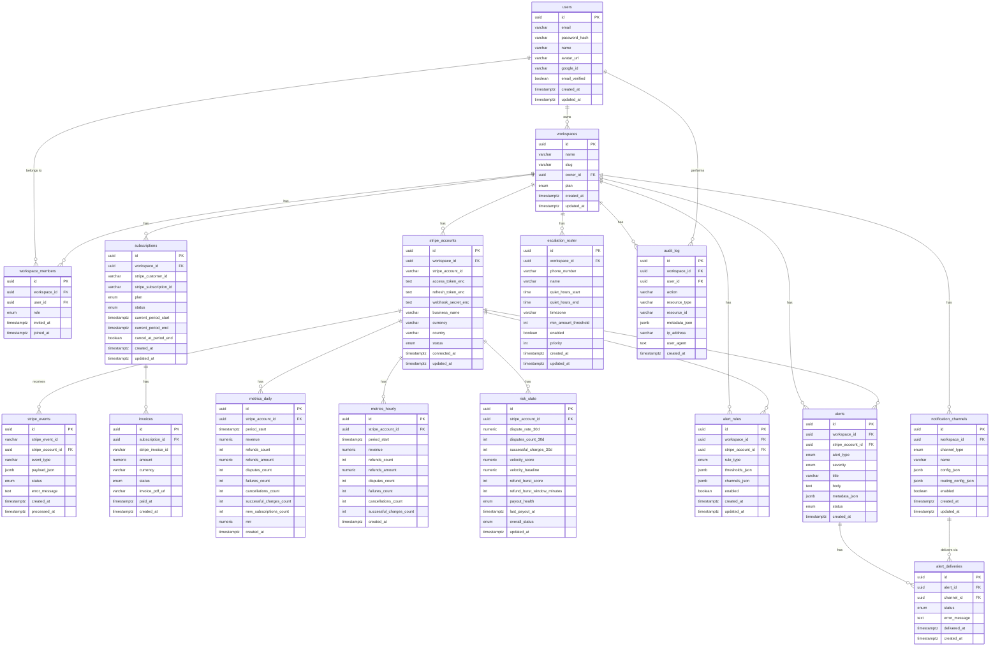

# MRRPulse Database Schema

## Table Descriptions

| Table | Description |
|-------|-------------|
| **users** | User accounts with email/password or Google OAuth |
| **workspaces** | Multi-tenant workspaces owned by users |
| **workspace_members** | Many-to-many relationship between users and workspaces |
| **stripe_accounts** | Connected Stripe accounts with encrypted credentials |
| **stripe_events** | Incoming Stripe webhook events for processing |
| **subscriptions** | MRRPulse subscription plans for workspaces |
| **invoices** | Billing invoices for subscriptions |
| **metrics_daily** | Aggregated daily metrics per Stripe account |
| **metrics_hourly** | Aggregated hourly metrics per Stripe account |
| **risk_state** | Real-time risk indicators (disputes, velocity, payouts) |
| **alert_rules** | User-configured alert thresholds and conditions |
| **alerts** | Generated alerts when rules are triggered |
| **alert_deliveries** | Delivery status for each alert per channel |
| **notification_channels** | Configured notification destinations (Slack, email, SMS) |
| **escalation_roster** | Phone escalation contacts with quiet hours |
| **audit_log** | Security audit trail for all actions |
